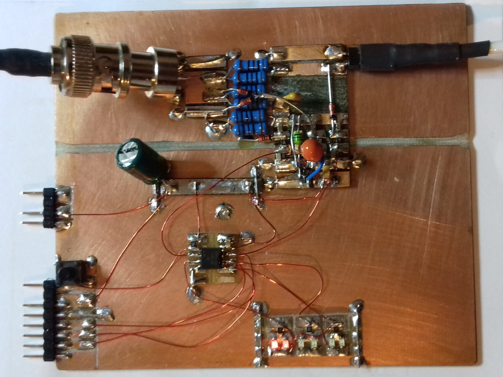

# BlinkySWR

Tiny, cheap, simple, accurate, self powered resistive SWR and power meter for SOTA and back packers

The SWR and power meter is based on a resistive bridge. The forward and reflected power is sampled by an ATTiny13A micro controller. The micro controller is powered by rectifying a tiny fraction of the input power, and the measured SWR and power is displayed by smoothly interpolating 6 high efficiency LED diodes.

Firmware for the ATTiny13A is found [here](firmware), while the simulation and design data is found [here](design).

The following picture shows the initial prototype of BlinkySWR, indicating SWR slightly above 1:1.

