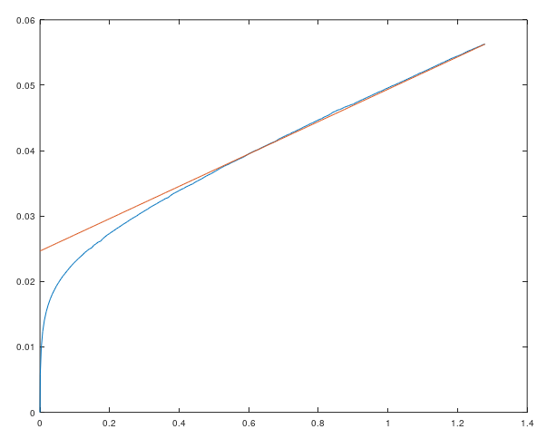

# Simulation and design

The BlinkySWR DC power recovery and SWR sampling circuits were simulated using the excellent free, unfortunately not open source [LTSpice](https://www.analog.com/en/design-center/design-tools-and-calculators/ltspice-simulator.html) tool by Linear Technologies. Installers for Windows and OSX are provided, and Linear Technologies makes sure that the Windows build runs under Wine on Linux.

The data produced by LTSpice was processed using the [Octave](https://www.gnu.org/software/octave/) software package, which is a free and open source alternative to [Matlab](https://www.mathworks.com/products/matlab.html) by [MathWorks](https://www.mathworks.com).

### Sampling circuit correction

The forward and reverse power is sampled by a hot carrier Shottky diode 1N5711, and the voltage drop at the sampling diode follows roughly the [Shockley diode equation](https://en.wikipedia.org/wiki/Shockley_diode_equation). We take an approach of modelling the sampling circuit in LTSpice using the SPICE model of the 1N5711 provided by [Diodes Incorporated](https://www.diodes.com/design/tools/spice-models/), providing a richer description of the diode behaviour than the [Shockley diode equation](https://en.wikipedia.org/wiki/Shockley_diode_equation) parameters. The SPICE model of the 1N5711 diode represents typical behavior of the diode at a room temperature, therefore the power and SWR reading by the BlinkySWR will not be quite accurate at freezing temperatures or under the desert sky. Temperature calibration is possible by putting another diode into a feedback loop of an op amp as in the [Accuprobe](http://www.kk5na.com/kk5na_files/AccupManual.htm) by the superb QRP designer Joe Everhart N2CX (SK), or by measuring a voltage drop at a reference diode by the microcontroller, but the ATTiny13A has no free input available and we did not want to complicate the design with an op amp.

[ltspice/blinky-diode-curve-parametric.asc](ltspice/blinky-diode-curve-parametric.asc) is an LTSpice model of input power sampling circuit including the ATTiny13A A/D sampling circuit, parametrized with SPICE STEP command to produce simulations for with the SWR bridge open (SWR infinity, transceiver sees SWR 1:2 and it produces maximum peak voltage). The .raw file produced by LTSpice contains transient analysis curves for input peak voltages from 0 to 50V peak. The .raw file is processed by [matlab/blinky-diode-curve.m](matlab/blinky-diode-curve.m) script to produce [matlab/blinky-diode-curve.mat](matlab/blinky-diode-curve.mat) sampling diode correction curve.

The following image shows the simulated diode correction curve. The voltage at the X axis represents the A/D reading, while the Y axis represents the diode voltage drop, which needs to be added to the A/D reading to get the sampled voltage. Blue curve represents the correction curve at room temperature for a typical 1N5711 diode, while the red line represents a linear interpolation of the curve. It is clear, that the diode voltage drop is far from 0.3V for the hot carrier 1N5711 diode, usually much higher (0.5V to 0.9V).

### Other models

[ltspice/blinky-power-supply.asc](ltspice/blinky-power-supply.asc) - model of the DC power recovery, to be used for assessing currents through the diodes, loading of the transceiver and harmonics created by the loading, driven with 7MHz / 1W source.

[ltspice/blinky-diode-curve.asc](ltspice/blinky-diode-curve.asc) - model of input power sampling circuit including the ATTiny13A A/D sampling circuit, with balanced SWR bridge, driven with 7MHz / 1W source.

[ltspice/blinky-diode-curve-open.asc](ltspice/blinky-diode-curve-open.asc) - model of input power sampling circuit including the ATTiny13A A/D sampling circuit, with the SWR bridge open (SWR infinity, transceiver sees SWR 1:2 and it produces maximum peak voltage), driven with 7MHz / 1W source.

### 3rd party models and scripts

[ltspice/spicemodels_schottky_diodes.txt](ltspice/spicemodels_schottky_diodes.txt) - SPICE model of 1N5711 diode, from [ltwiki.org](http://ltwiki.org/files/LTspiceIV/Vendor%20List/Diodes%20Incorporated/Spice/spicemodels_schottky_diodes.txt)

[matlab/LTspice2Matlab.m](matlab/LTspice2Matlab.m) - 
Import of ltspice .raw files (simulation results), by [Paul Wagner](https://www.mathworks.com/matlabcentral/fileexchange/23394-fast-import-of-compressed-binary-raw-files-created-with-ltspice-circuit-simulator?focused=5113448&tab=function), extended for Octave compatibility by [Thorben Casper](https://github.com/tc88/ANTHEM/blob/master/src/LTspice2Matlab.m)
