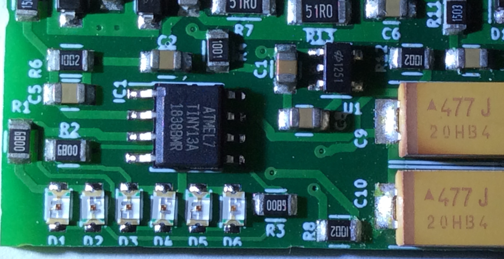

# BlinkySWR

A tiny, cheap, simple, accurate, energy harvesting resistive SWR and power meter for SOTA and back packers.

Circuit and firmware by Vojtech OK1IAK, printed board design by Dan OK1HRA.

Circuit revision 0.2-S, firmware version 1.0

## Introduction

The BlinkySWR is an accurate microprocessor based replacement of the famous Tayloe SWR bridge. As such, the SWR presented by the bridge to the transceiver never exceeds 1:2. The BlinkySWR was designed with a no-tuner or limited tuning range back packing antenna installations in mind, where a Tayloe SWR bridge may not reveal the true SWR. The circuit was inspired by the [N2CX (SK) Rainbow Tuner](http://www.njqrp.club/Rainbow/rb_home.html), while being much simpler and self powered.

The SWR and power is shown by a 6 LED baragraph, where 21 discrete levels of SWR presented by interpolating intensities of neighboring LEDs, thus allowing for an analog-like SWR tuning experience. The SWR bridge electronics is powered by rectifying a tiny bit of the RF power. After transceiver key off, the measured transmit power is shortly indicated on the baragraph by discharging on board large capacitors.

The builder has to solder 6 SMD LEDs and SMD 8-pin AtTiny13A micro to the partially assembled board.

## Specification

- Maximum allowable short-term input power: 10W
- Maximum short-term power for full SWR meter resolution: 7W
- Minimum input power to power the electronics: 0.5W
- Current drawn from the transceiver to power the circuit: 1.2mA
- High SWR and power accuracy achieved by averaging eight 10bit samples and software linearization of the diode curve (power accuracy limited by the AtTiny13A internal voltage referenece).
- Continuous transmit power or slow CW (dashes) is required for the electronics to work correctly.

The SWR and power levels are shown on a 6 LED baragraph, where 4 levels are interpolated between two LED positions. 
1. LED1 fully on, LED2 fully off
2. LED1 nearly fully on, LED2 glowing a bit
3. LED1 and LED2 glowing at the same mid intensity
2. LED1 glowing a bit, LED2 nearly fully on

SWR is shown while the key is being held down. On key up, the measured power is shown at three scales: Normal, Low and High. The normal scale is shown imediately, while the low / high scale is indicated by a up / down "running light" effect preceding the power baragraph display. The baragraph SWR / power table follows:

| Baragraph | SWR    | Normal Power | Low Power   | High Power   |
|-----------|----------:|----------:|------------:|-------------:|
| **LED1**  |**1:1.000**| **1.00W** | **0.2500W** |              |
|           |  1:1.125  |   1.25W   |   0.3125W   |              |
| 1+2       |  1:1.250  |   1.50W   |   0.3750W   |              |
|           |  1:1.375  |   1.75W   |   0.4375W   |              |
| **LED2**  |**1:1.500**| **2.00W** | **0.5000W** |              |
|           |  1:1.625  |   2.25W   |   0.5625W   |              |
| 2+3       |  1:1.750  |   2.50W   |   0.6250W   |              |
|           |  1:1.875  |   2.75W   |   0.6875W   |              |
| **LED3**  |**1:2.00** | **3.00W** | **0.7500W** |              |
|           |  1:2.25   |   3.25W   |   0.8125W   |   6.5W       |
| 3+4       |  1:2.50   |   3.50W   |   0.8750W   |   7.0W       |
|           |  1:2.75   |   3.75W   |   0.9375W   |   7.5W       |
| **LED4**  |**1:3.00** | **4.00W** |             | **8.0W**     |
|           |  1:3.50   |   4.25W   |             |   8.5W       |
| 4+5       |  1:4.00   |   4.50W   |             |   9.0W       |
|           |  1:4.50   |   4.75W   |             |   9.5W       |
| **LED5**  |**1:5.00** | **5.00W** |             | **10.0W**    |
|           |  1:5.75   |   5.25W   |             |   10.5W      |
| 4+5       |  1:6.50   |   5.50W   |             |   11.0W      |
|           |  1:7.25   |   5.75W   |             |   11.5W      |
| **LED6**  |**1:8.00** | **6.00W** |             | **12.0W**    |

## Building the kit

#### 1) Solder the AtTiny13A.
The SOIC-8 part is quite easy to solder with a thin tipped temperature regulated soldering iron. Inspect for solder bridge with a strong light and magnifier glass or with a digital volt meter measuring resistance. Solder bridges are easily removed with a solder wick soaked in soldering flux. An excess flux is easily removed with a paper towel soaked in alcohol.

#### 2) Solder the 6 LEDs.
The LEDs are tiny and a bit challenging to solder, so we provided two spares. The cathodes are marked with a green dot and the anode / cathode flips with each LED, the neighboring LEDs are opposite oriented.

First deposit a tiny bit of solder onto the 6 pads closer to the controller. Then hold a LED with the tweezers and re-melt the already deposited bit of solder to tack one LED terminal to the board. Then solder the other LED terminal. You may then re-melt and possibly add yet a bit more solder to the 1st LED terminal. Repeat another five times.

## Application examples

The BlinkySWR could either be installed inside an antenna tuner as a replacement of the Tayloe SWR bridge, or it could be plugged between the transceiver and antenna, antenna tuner or antenna balun. The BlinkySWR uses a resistive SWR bridge, which consumes 3/4 of transceiver power, therefore the SWR bridge should be plugged out of the antenna circuit during normal transmit operation.

The BlinkySWR board is especially useful with end fed half wave tuners, which have limited or no tuning capabilities. Without an accurate SWR meter these antenna setups are often operated at improper conditions. We recommend an untuned EFHW transformer recommended by 
[Steve Dick, K1RF](http://gnarc.org/wp-content/uploads/The-End-Fed-Half-Wave-Antenna.pdf) on page 25 of his presentation. The transformer has been later analyzed by [Owen Duffy](https://owenduffy.net/blog/?p=12642). The transformer is wound with 3T:27T on a Fair-rite 2643625002 core (16.25×7.29×14.3mm, material #43), available at Mouser for a meager $0.61 in single piece quantity. We have found out, that it may be beneficial to wind the primary with 5 turns primary with taps at 3rd and 4th turn to extend the tuning range. Another good configuration is a resonant EFHW transformer wound on T50-6 iron core as in [QRP Guys tuner](https://qrpguys.com/end-fed-half-wave-sota-antenna-tuner). The resonant transformer configuration allows for some tuning and it likely  is a bit less lossy than the untuned transformer.

The BlinkySWR board fits two SMA connectors. These SMA connectors and SMA pig tails could be cheaply obtained on ebay or aliexpress. A piece of thin coaxial cable could be soldered to the BlinkySWR board directly as well.

## Design documents

For some reason github mangles the schematic. Please follow [this link to download schematic in PNG](https://raw.githubusercontent.com/bubnikv/BlinkySWR/master/doc/blinkyswr-schematic-0.2-S.png) or [this link to download schematic in PDF](https://rawgit.com/bubnikv/BlinkySWR/master/kicad/02-S-4r/BlinkySWR-0.2-S.pdf).

A complete kicad design could be [downloaded from here](https://remoteqth.com/download-count.php?Down=hw/BlinkySWR-0.2-S-4r.zip), and an interactive board view with BOM [is available here](https://rawgit.com/bubnikv/BlinkySWR/master/kicad/02-S-4r/ibom.html).

## Theory of operation

### Circuit

The BlinkySWR implements a classic resistive SWR bridge with a little twist.  Usually the bridge peak voltages are sampled against the transceiver / antenna ground level, while the BlinkySWR creates an artificial ground at half the transceiver / ground voltage level. The BlinkySWR circuit is powered by harvesting roughly 1.2mA from the transceiver and the artificial ground allows for full wave rectification of the transceiver output, therefore lowering distortion of the transceiver sine waveform caused by the energy harvesting circuit. Simulation of the energy harvesting circuit produced 3rd harmonic between -34dB and -39dB below the carrier.

The double rectified RF current is fed into a high voltage tollerant 2.5V linear regulator HT7125-1 by Holtek. This linear regulator has an extremely low quiescent current, while tollerating maximum 24V at input. This part is crucial for achieving large input power operating range.

The linear regulator is powered through a 1 kOhm resistor to limit the inrush current when charging two 470 uF electrolytic capacitors at its output. When fully discharged, the capacitors act as short circuit, therefore the 1 kOhm resistor limits the harmonics generated by the energy harvesting diodes before these capacitor charge.

The resistive SWR bridge is sampled with two 1n5711 Shottky diodes and the sampled voltage is fed into 10bit A/D converter inputs of the AtTiny13A microcontroller. Three output pins of the micro are [charlieplexed](https://en.wikipedia.org/wiki/Charlieplexing) to power one of 6 LEDs. Very high intensity red LEDs are used, as red LEDs work at 1.8V thus allowing the BlinkySWR to work at 0.5W input power, and low current is required to produce least distortion of the input waveform.

### Firmware

The AtTiny13A microcontroller was selected as a time proven, low power and cheap soltion with open C/C++ tool chain. The AtTiny13A is a low end chip with 1KB program FLASH, 64B RAM, 64B EEPROM, 5 GPIO pins and 10bit A/D converter and it was quite a challenge to squeeze all the functionality and accuracy into 1KB of program.

A prototype firmware running at high CPU speed and without utilizing the power saving functonality of the chip drew easily 1.5mA, which is about 1.5x more than the LED baragraph. The final firmware sleeps when sampling the analog inputs and between measurement cycles to lower measurement noise and power consumption. The final microprocessor power consumption is around 0.2mA.

High accuracy is achieved by 8x oversampling the forward and reverse voltages, and by compensating the non-linear characteristics of the 1n5711 diode curves by software. The sampling characteristics of the diodes was simulated in the circuit using [LTSpice](https://www.analog.com/en/design-center/design-tools-and-calculators/ltspice-simulator.html). See the [BlinkysWR design notes](https://github.com/bubnikv/BlinkySWR/tree/master/design) for LTSpice and Matlab sources. The diode curve is interpolated by two tables: One dense table samples the diode knee, while the other table samples the rest of the curve. The diode correction is then linearly interpolated from the table. One of the tables is stored in FLASH, while the other is stored in EEPROM.

More than 6 levels on the 6 LED baragraph are achieved by PWM modulating neighboring LEDs. As the clock is suppressed during the A/D sampling for reduced noise, hardware PWM was not an option and the PWM is implemented in software inside the main sampling loop. See the comments in the [firmware source code](https://github.com/bubnikv/BlinkySWR/blob/master/firmware/blinkyswr.c) for details on the main loop timing.

We tried to interpolate intensity of the neighboring LEDs smoothly, but that did not work well, as the LED intensities are not exactly equal and sensitivity of a human eye is not great either, therefore it was difficult for the operator to judge the interpolated value from the two LED intensities. At the end we decided to add just two another interpoated values: neighboring LEDs lit with equal intensities, and one LED just glowing while the other LED lit with high intensity. These levels are easy to discern even if the LEDs are not quite the same or if they are not soldered exactly flat to the printed board.

The firmware is available on [github](https://github.com/bubnikv/BlinkySWR/tree/master/firmware). The fimrware is released under [GPL2 license](https://www.gnu.org/licenses/old-licenses/gpl-2.0.en.html). The latest [AVR GCC toolchain](https://www.microchip.com/mplab/avr-support/avr-and-arm-toolchains-c-compilers) from Microchip is recommended to compile BlinkySWR, as the firmware fills up the FLASH to the last byte and less optimizing compiler would not work.

## Copyright

The hardware (circuit, board design) is released under [CERN OHL 2](https://www.ohwr.org/project/cernohl/wikis/Documents/CERN-OHL-version-2) license.
The fimrware is released under [GPL2 license](https://www.gnu.org/licenses/old-licenses/gpl-2.0.en.html).

The circuit and firmware is fully open even for commercial use and we will be happy if the design is reproduced. If you do so, please cite OK1IAK and OK1HRA as authors of the original design.

## Further work

We are considering designing a tiny QRP SWR / power meter / EFHW antenna tuner combo. Actually our first prototypes were such designs. Depending on feedback & demand, we may consider reviving this project.

Another venue of future work would be measuring not two, but three voltages at the resistive bridge, allowing to calculate absolute value of an atenna admitance. Such firmware would not fit the AtTiny13A, but the new ATtiny212/412 are much more powerful and they are bargain.
