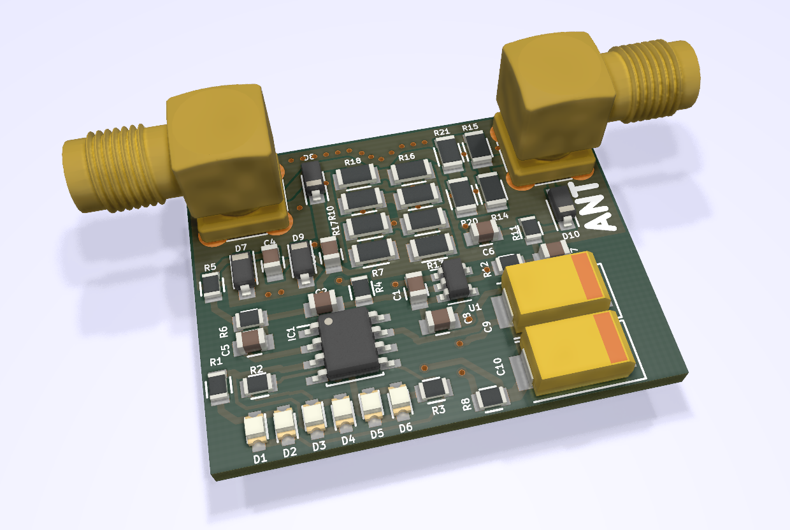

# BlinkySWR PCB board

KiCad PCB layout

* [Schematics rev0.2](02-S-4r/BlinkySWR-0.2-S.pdf)
* [Interactive bom](http://htmlpreview.github.io/?https://github.com/bubnikv/BlinkySWR/blob/master/kicad/02-S-4r/ibom.html)
* [STEP 3D model](02-S-4r/BlinkySWR-0.2-S.step)
